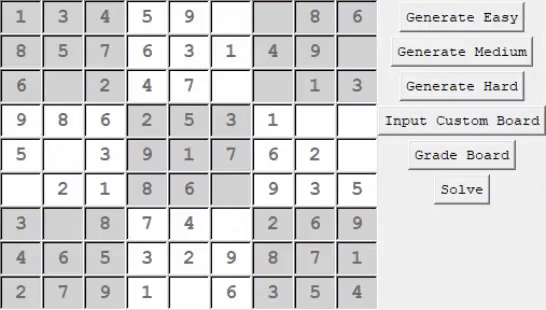
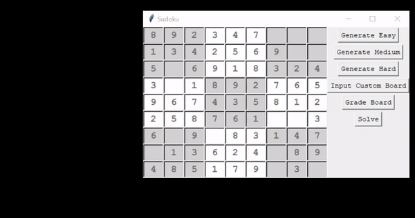
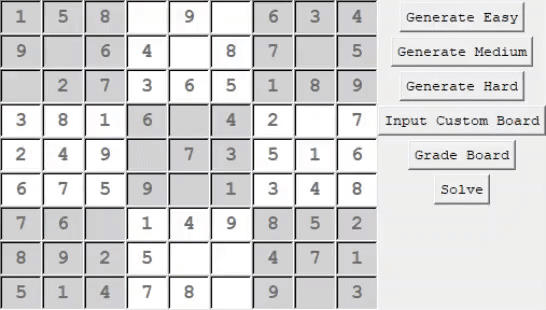
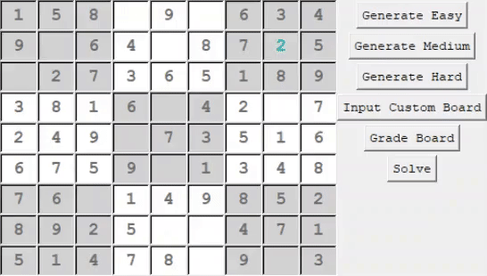

# Sudoku
Sudoku GUI program built with Tkinter - generates, grades, and solves Sudoku boards using a backtracking algorithm.

## Installation
Ensure you have Python 3 installed. Clone this repository and open the SudokuGUI.py file to open the Sudoku game.

## How to Play
Generate an Easy, Medium, or Hard board to play.

Or input your own custom Sudoku board.

 

Get a visual cue of your progress using 'Grade Board' - a flash or red means the board (with all current entries) is unsolvable.
Yellow means it is solvable, but not yet solved. Green indicates a fully solved board.

Solve the board to instantly fill in the solution.

